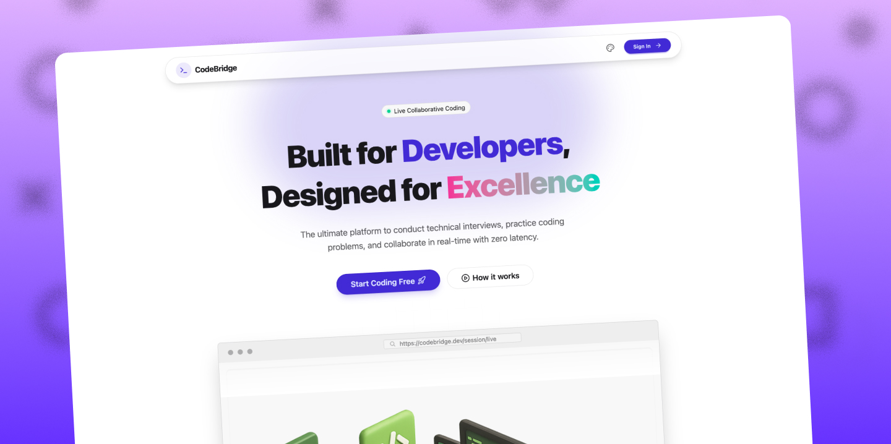
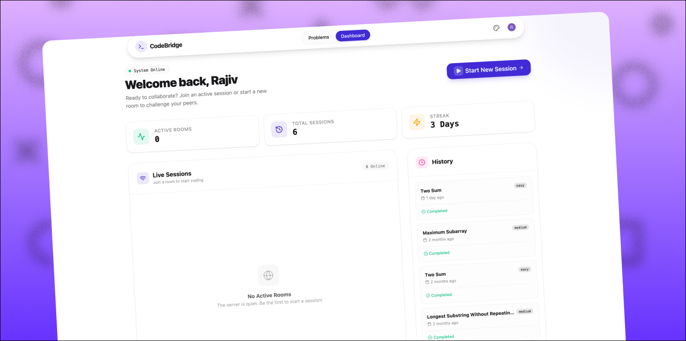
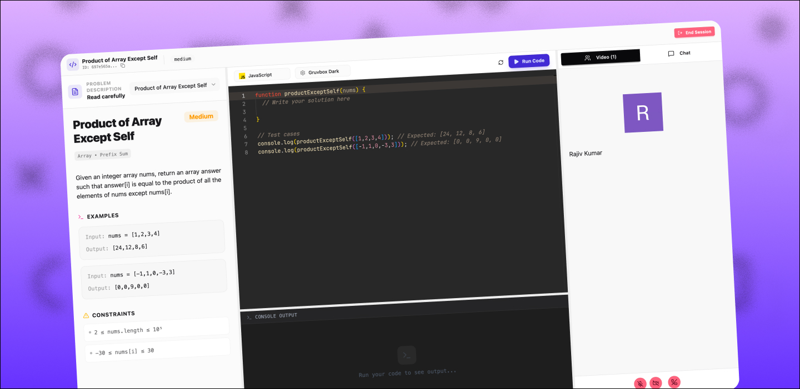

# 🚀 CodeBridge

CodeBridge is a high-performance, collaborative coding platform designed for technical interviews and peer programming. It pairs a real-time synchronized code editor with low-latency video conferencing and chat.



## ✨ Key Features

- **Collaborative Editor:** Real-time code synchronization with syntax highlighting and multi-language support.
- **Integrated Video & Chat:** Powered by **Stream SDK** for a seamless, low-latency interview experience.
- **Code Execution:** Frontend integration with the **Piston API** to execute code and view output instantly.
- **Secure Authentication:** User management and session security handled via **Clerk**.
- **Automated Workflows:** **Inngest** functions handle Clerk user lifecycle events to keep local databases and Stream user lists in sync.
- **Session History:** Track your progress with a personalized dashboard, streaks, and previous challenge history.

---

## 🛠 Tech Stack

| Layer               | Technology                                      |
| :------------------ | :---------------------------------------------- |
| **Frontend**        | React (Vite), TailwindCSS, DaisyUI, React Query |
| **Backend**         | Node.js (ESM), Express, Mongoose (MongoDB)      |
| **Auth**            | Clerk                                           |
| **Real-time**       | Stream Video & Stream Chat                      |
| **Execution**       | Piston API                                      |
| **Background Jobs** | Inngest                                         |

---

## 📸 Interface Preview

### User Dashboard
Manage active rooms, view your 3-day coding streak, and revisit completed challenges like *Two Sum* and *Maximum Subarray*.



### Collaborative Workspace
The core environment features a split-pane layout with the problem description, a Monaco-powered editor, and a live video sidebar.



---

## 🚀 Getting Started

### Prerequisites
- **Node.js 18+**
- **MongoDB** (Atlas or Local)
- **Clerk Account** (Auth)
- **Stream Account** (Video/Chat)

### 1. Clone & Install
```bash
git clone https://github.com/your-username/codebridge.git
cd codebridge

# Install Backend deps
cd backend && npm install

# Install Frontend deps
cd ../frontend && npm install
```

### 2. Environment Setup
Create a `.env` file in both directories.

**backend/.env**
```env
PORT=5000
MONGO_URI=your_mongodb_connection_string
CLIENT_URL=http://localhost:5173
STREAM_API_KEY=your_stream_key
STREAM_API_SECRET=your_stream_secret
VITE_CLERK_PUBLISHABLE_KEY=your_clerk_pub_key
CLERK_SECRET_KEY=your_clerk_secret_key
```

**frontend/.env**
```env
VITE_API_URL=http://localhost:5000/api
VITE_CLERK_PUBLISHABLE_KEY=your_clerk_pub_key
```

### 3. Run Locally
```bash
# Terminal 1: Backend
cd backend && npm run dev

# Terminal 2: Frontend
cd frontend && npm run dev
```

---

## 📡 API Reference

| Endpoint                  | Method | Description                          |
| :------------------------ | :----- | :----------------------------------- |
| `/api/sessions`           | POST   | Create a new coding session          |
| `/api/sessions/active`    | GET    | List all current active rooms        |
| `/api/sessions/my-recent` | GET    | Fetch user's completed history       |
| `/api/sessions/:id/join`  | POST   | Join a session and get Stream tokens |
| `/api/sessions/:id/end`   | POST   | Close a session (Host only)          |
| `/api/chat/token`         | GET    | Get Stream chat token for user       |

---

## 📂 Repository Structure

```
codebridge/
├── backend/          # Express server, Mongoose models, Inngest handlers
│   ├── models/       # MongoDB schemas
│   ├── routes/       # API endpoints
│   ├── controllers/  # Business logic
│   └── inngest/      # Background job functions
│
├── frontend/         # Vite-based React app
│   ├── src/
│   │   ├── components/  # Reusable UI components
│   │   ├── pages/       # Route pages
│   │   ├── hooks/       # Custom React hooks
│   │   └── utils/       # Helper functions
│   └── public/
│       └── screenshots/ # Demo images
│
└── README.md
```

---

## 🙏 Acknowledgments

- **Stream** for providing excellent real-time SDKs
- **Clerk** for seamless authentication
- **Piston API** for code execution capabilities
- **Inngest** for reliable background job processing

---

Built with ❤️ for the developer community.